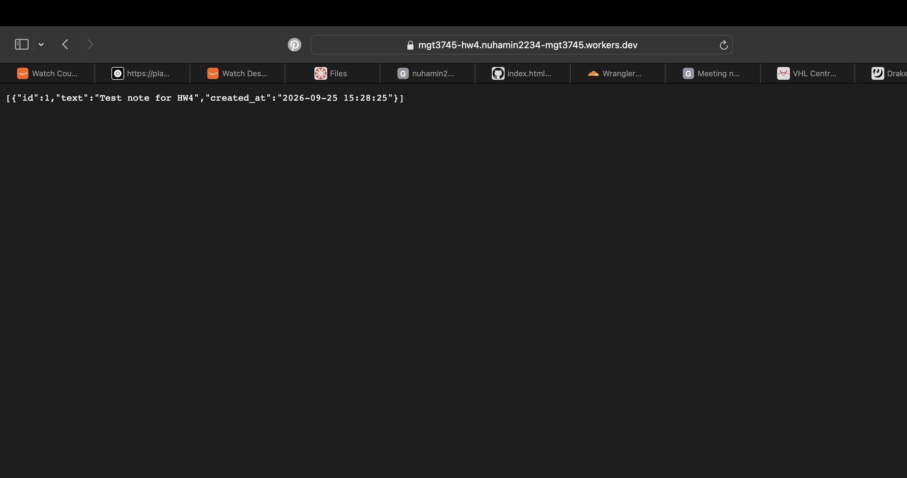

# Meeting notes across browsers

## What

[HW3 repository](https://github.com/nuhamin2234/mgt3745-hw3). This page lets a student save short, fictional meeting notes and find them from another browser session. See [PROJECT.md](context/PROJECT.md) and [FEATURES.md](context/FEATURES.md). Notes now live in Cloudflare D1 through a Worker because clearing browser data would remove localStorage notes. [ADR-002](context/ARCHITECTURE.md) records the decision. The list is public and shared, so users should not enter sensitive information.

## See It Work

I saved “Test note for HW4” on the page, then opened the Worker in a private browser window. The same note appeared there, showing that it is stored in D1 rather than only in my browser.

## How to Run

Deployed Worker: https://mgt3745-hw4.nuhamin2234-mgt3745.workers.dev/entries

Open `index.html` with Live Server in a Codespace to use the page. From a fresh Codespace, run `npm install`, sign in with `npx wrangler login --device`, create a D1 database, place its ID in `wrangler.toml`, run `npm run db:schema`, and run `npm run deploy`. See [the Session B commands](docs/SESSION_B_COMMANDS.md).

To run the Worker locally, first run `npx wrangler d1 execute mgt3745-entries --local --file=schema.sql`, then `npm run dev` on port 8787.

## Status

| Feature | Verdict |
|---|---|
| Save a valid note | PASS: saved through the page |
| Read from a private browser window | PASS: the same note appeared from D1 |
| Reject an invalid note | Implemented; direct 400 test pending |
| Delete a note | Implemented; browser test pending |
| Network unavailable | CANNOT TEST YET: outage test pending |
| Simultaneous editing | DEFERRED in ADR-002 |

Full results belong in [FEATURES.md](context/FEATURES.md#verification).

## Links

Read in order: [PROJECT.md](context/PROJECT.md) → [USERS.md](context/USERS.md) → [FEATURES.md](context/FEATURES.md) → [ARCHITECTURE.md](context/ARCHITECTURE.md) → [STANDARDS.md](context/STANDARDS.md) → [TOOLS.md](context/TOOLS.md) → [STYLE.md](context/STYLE.md) → [CLAUDE.md](context/CLAUDE.md).

## AI Use

ChatGPT helped draft the Worker validation, Delete route, page fetch calls, and documentation. I checked JavaScript syntax with `node --check`, deployed the Worker, saved a note through the page, and retrieved it in a private browser window. I could not fully verify what the CORS headers did by reading them, so I tested the page calling the Worker from a different origin. A simulated network failure still needs testing. Hours spent: 5.
